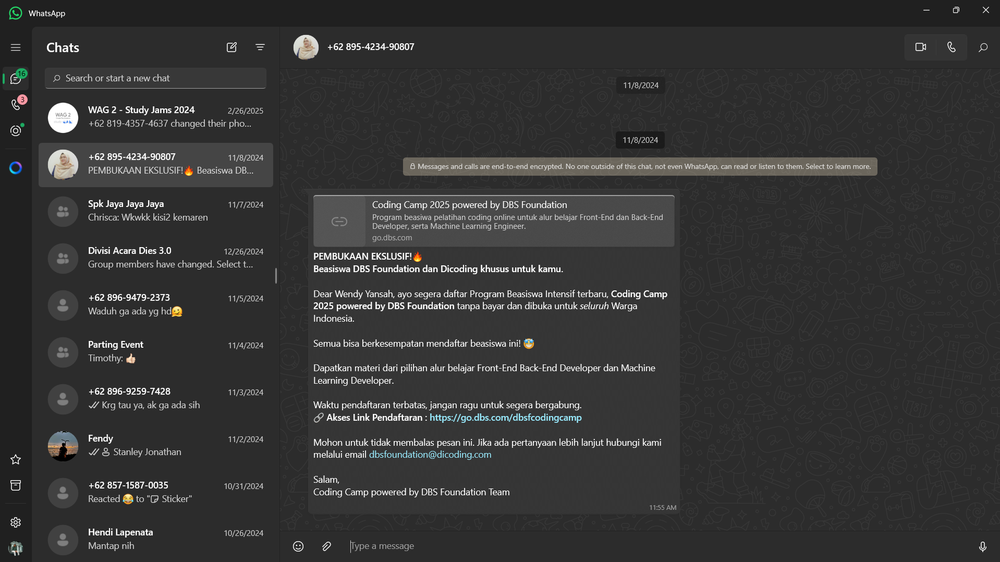
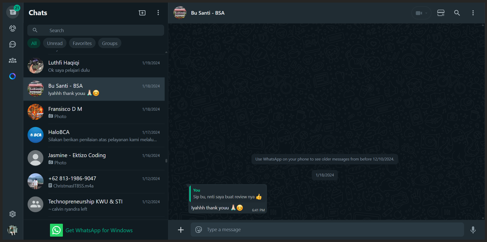
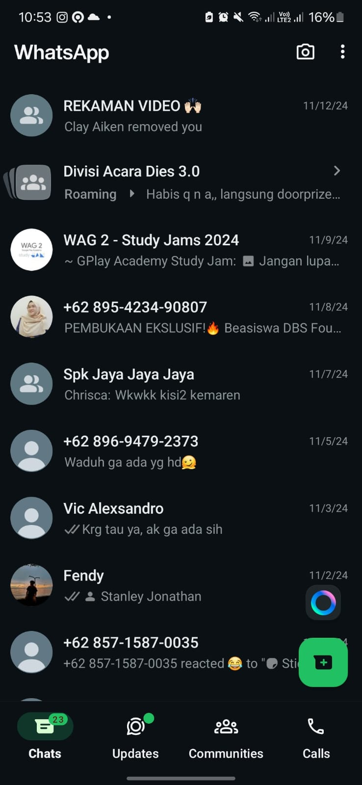

<h2 align="center">Adaptive Design based on Cross Platform Concept</h2>

Wendy Yansah | 22100032

## Apa itu Whatsapp?
WhatsApp adalah aplikasi pesan instan yang memungkinkan pengguna untuk mengirim pesan teks, suara, gambar, video, dokumen, serta melakukan panggilan suara dan video melalui internet. WhatsApp populer karena antarmukanya yang sederhana, bebas iklan, dan menggunakan enkripsi end-to-end untuk menjaga privasi pesan pengguna. Aplikasi ini tersedia di berbagai platform, termasuk Android, iOS, dan versi web (WhatsApp Web).

## Responsive Design pada Whatsapp
WhatsApp menerapkan <b>Responsive UI</b> dan <b>Adaptive Design</b> untuk memastikan pengalaman pengguna yang optimal di berbagai perangkat. Responsive UI pada WhatsApp memungkinkan antarmuka menyesuaikan ukuran dan tata letak berdasarkan ukuran layar, baik pada ponsel, tablet, maupun web.

Pada WhatsApp Web, Desktop atau versi tablet, layar terbagi menjadi dua panel: daftar chat di sebelah kiri dan isi percakapan di sebelah kanan. Hal ini memanfaatkan teknik seperti flexible layouts dan media queries agar tampilan tetap rapi dan nyaman di berbagai resolusi layar.

Sementara pada ponsel (smartphone), daftar chat dan isi percakapan ditampilkan dalam satu layar penuh dan dipisah menjadi 2 bagian. Hal ini menyesuaikan dengan ukuran perangkat smartphone yang memiliki lebar lebih kecil dan memanfaatkan sistem full layout sehingga tidak terkesan terlalu sempit.

## Adaptive Design pada Whatsapp
Adaptive Design digunakan untuk menyesuaikan pengalaman pengguna berdasarkan platform dan perangkat yang digunakan. Contohnya, di iOS, WhatsApp mengikuti desain khas Apple dengan tab bar di bagian bawah, sementara di Android, navigasi lebih mengadopsi material design dengan floating action button (FAB) untuk memulai percakapan. Selain itu, pada perangkat dengan layar lipat atau tablet, WhatsApp dapat menyesuaikan tata letak agar lebih efisien, seperti menampilkan lebih banyak informasi sekaligus. Dengan kombinasi responsive UI dan adaptive design, WhatsApp memastikan pengalaman pengguna yang konsisten dan intuitif di berbagai perangkat tanpa mengorbankan fungsionalitas.

## Bagaimana dengan pengaruh UX sendiri dalam mendesain UI yang lebih baik didalam Whatsapp?
User Experience (UX) berperan penting dalam mendesain User Interface (UI) WhatsApp agar lebih intuitif, efisien, dan nyaman digunakan. UX berfokus pada bagaimana pengguna berinteraksi dengan aplikasi, memastikan bahwa setiap elemen UI dirancang untuk memenuhi kebutuhan mereka dengan cara yang sederhana dan efektif. Dengan memahami kebiasaan pengguna, UX membantu dalam merancang UI yang mudah dinavigasi, seperti tata letak daftar chat yang jelas, ikon yang intuitif, serta akses cepat ke fitur utama seperti panggilan dan pesan suara.

Selain itu, UX membantu dalam mengoptimalkan flow penggunaan aplikasi, seperti proses pengiriman pesan yang cepat dan minim hambatan, fitur pencarian chat yang efisien, serta integrasi berbagai fitur tanpa mengganggu pengalaman pengguna. Contohnya, fitur double tick (centang dua) untuk menandai pesan terkirim dan terbaca adalah hasil dari pemikiran UX yang meningkatkan transparansi komunikasi. Dengan pendekatan berbasis UX, WhatsApp dapat menciptakan UI yang tidak hanya menarik secara visual tetapi juga meningkatkan kenyamanan, kecepatan, dan kepuasan pengguna dalam berkomunikasi.
